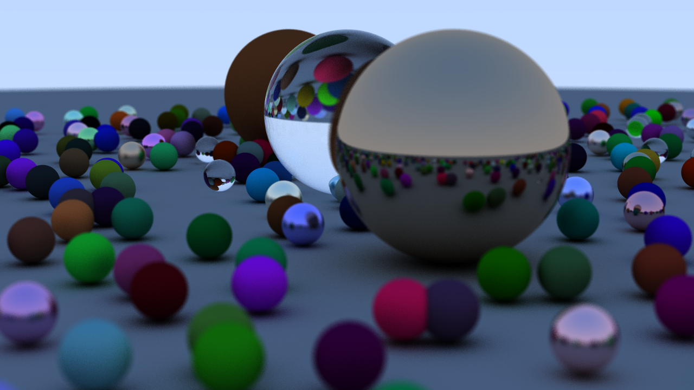

# rtxon

Simple raytracer built as a learning exercise in Rust

Initial implementation loosely following [Peter Shirley's Ray Tracing in One Weekend](http://www.realtimerendering.com/raytracing/Ray%20Tracing%20in%20a%20Weekend.pdf)

